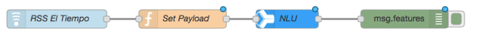
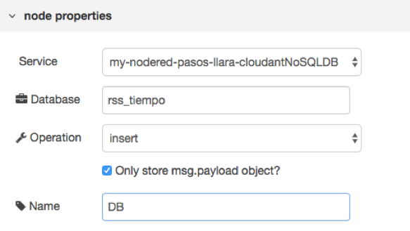
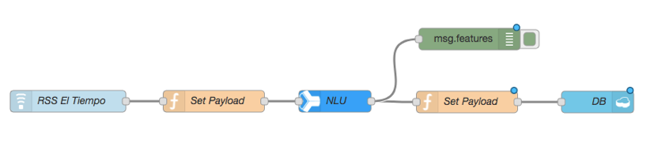
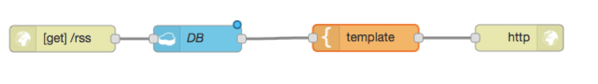
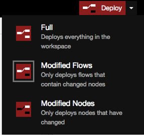

# Node-RED Analisis de Noticias

Node-RED es una herramienta de código abierto que permite construir aplicaciones simplemente uniendo elementos entre sí en un ambiente gráfico. Estos elementos pueden representar dispositivos de hardware, APIs web o servicios accesibles en internet. 

En IBM Cloud es muy sencillo crear un ambiente Node-RED que pueda acceder a los servicios de la plataforma. En este documento se mostrarán cómo construir tu primera aplicación usando esta herramienta. 

## Componentes Incluidos

* [Node-RED](https://nodered.org/): Es un framework Open Source que permite construir aplicaciones basdas en flujos y eventos.
* [Cloudant](https://console.ng.bluemix.net/catalog/services/cloudant-nosql-db): Una base de datos completamente manejada diseñada para aplicaciones web y mobile modernas que usan documentos como JSON.
* [Watson Natural Language Understanding](https://www.ibm.com/watson/developercloud/natural-language-understanding/api/): Usa procesamiento de lenguaje natural para extraer caracteristicas semanticas de cualquier texto.

## Tecnologías Importantes

* [Watson](https://www.ibm.com/watson/developer/): Watson en IBM Cloud permite integrar herramientas de AI en tu aplicación y guardar, entrenar y manejar tu data en una nube segura.

# Paso a Paso

### 1. Crear el servicio Node-RED

En el catalogo de IBM Cloud, crea el servicio de [Node-RED](https://console.bluemix.net/catalog/starters/node-red-starter)
* Dale un nombre único a la aplicación, este nombre será usado para crear un subdominio web.
* Haz click en _Crear_
* Espera a que la aplicación inicialice

### 2. Configurar el framework Node-RED

* Haz click en el enlace _Visit app URL_ o _Visitar URL de app_
* Entrarás al paso a paso para configurar el framework. En el primer paso simplemente haz click en _Next_
* En el segundo paso debes crear un usuario y contraseña para entrar a editar los flujos de la aplicación. Después que ingreses el usuario y contraseña haz click en _Next_
* En el tercer paso se sugieren algunas librerias adicionales. Haz click en _Next_.

> Si quieres buscar librerias puedes buscarlas en [Node-RED Library](https://flows.nodered.org/?num_pages=1).
* En el ultimo paso haz click en _Finish_ para terminar la configuración del framework.
* Espera a que los cambios sean implementados y el framework este listo para ser usado.

### 3. ¡Hola Mundo!

En el panel izquierdo se encuentran diferentes nodos para manejar entradas, salidas, funciones, redes sociales, almacenamiento, API de Watson y otras que se pueden utilizar en tus flujos. La sección central presenta espacio en blanco para diseñar flujos. Finalmente, el panel de la derecha tiene una pestaña para desplegar información del nodo seleccionado y una pestaña para desplegar mensajes de debug.

Hay dos tipos de nodos, los que tienen una conexión y los que tienen dos conexiones. Los que tienen una conexión son de entrada o salida y los que tienen dos conexiones son nodos intermedios o funciones.

* Arrastra un nodo **Inject** y has doble click para modificar sus propiedades.
* En la opción **Payload** selecciona _String_ y le asignas `Hello world`.
* Añade un nodo de salida ‘debug’. Este nodo escribirá en la consola lo que llegue a él.
* Conecta los nodos entre sí.


* Prueba el flujo creado. Para esto se debe desplegar el flujo con el botón en la parte superior derecha **Deploy**.

> Al lado de los nodos se encuentran botones para usarlos. El botón del nodo ‘debug’ abre/cierra el puerto en el que escucha la consola. Por otro lado, el botón en ‘inject’ envía lo que tenga predeterminado enviar. 

* En el panel derecho se encuentra la pestaña debug, ábrela y comprueba que tu flujo funciona correctamente.

### 4. Captura de Noticias

Por medio del siguiente flujo se pueden recibir las noticias que se escriban en tiempo real de alguna fuente que utilice RSS.

* Ingresa un nodo de **feedparse** al workspace. Este se encuentra en la categoria _Advanced_. 
*	Luego hay que configurar la URL del RSS en el nodo. Busca el RSS que desees en un buscador, por ejemplo https://www.eltiempo.com/rss/opinion.xml es el feed de El Tiempo la seccion de opinion
*	Conecta a un nodo de debug, despliega el servicio y ve a la consola debug para ver las noticias del feed. Configura el debug para ver el objecto **msg** completo.

### 5. Procesamiento de Lenguaje Natural

Ahora se va a utilizar un Natural Language Understanding para analizar los conceptos, las entidades y el sentimiento general con el que se escribio la noticia.

* Agregue al flujo anterior un nodo **function** y únelo al nodo de entrada (feedparse). En este nodo vamos a configurar la variable `msg.payload` con el link de la noticia.
*	En el nodo function copie y pegue el siguiente codigo:

```javascript
msg.payload = msg.topic;
return msg;
```

*	Agregue un nodo ‘Natural Laguage Understanding” al flujo. Este nodo es un API de Watson que realiza procesamiento de lenguage natural
*	En otra pestaña del explorador, entre a IBM Cloud > Catalogo > AI y crea un servicio [Natural Language Understanding](https://console.bluemix.net/catalog/services/natural-language-understanding)
*	Cuando se cree el servicio copie las credenciales del servicio
* Pegue las credenciales en el nodo de Node-Red
*	Arrastre el nodo de **Debug** y configurelo para ver el objeto `msg.features`
*	Despliega el servicio y comprueba su funcionamiento



### 6. Almacenamiento de noticas en Cloudant NoSQL DB

Al principio en la creación del servicio de Node-RED se agregó automaticamente una instancia de Cloudant NoSQL DB. Esta se va a utilizar para almacenar las noticias y el procesamiento de lenguaje natural.

*	Agrega un nodo **function** con el cual vamos a configurar la variable `msg.payload` con la respuesta del Natural Language Understanding. Copie y pegue el siguiente codigo dentro de este nodo:

```javascript
msg.payload = msg.features;
return msg;
```

*	Agrega el nodo de Cloudant NoSQL DB. Asegúrese de utilizar el nodo que tenga una sola entrada, ya que solo se desea almacenar.
*	Configura el servicio haciendo doble clic sobre el nodo. En el campo _Service_ se escoge la instancia de Cloudant, en la cual está el servicio de la base de datos. En _Database_ debes indicar el nombre del fichero o esquema que va a guardar los datos deseados. _Operation_ designa la función que se realiza en el proceso, en este caso insertar. Selecciona la opción `Only store msg.payload object`



*	Para finalizar, conecta la salida de la función a la entrada de la base de datos. Luego despliega el flujo para empezar a almacenar los datos.



*	Revise el servicio de la base de datos en el ‘dashboard’ de IBM Cloud https://console.bluemix.net/dashboard/apps/
Luego de escoger el servicio de Cloudant, se abre una ventana como la que sigue. Entra a la interfaz por el botón ‘Launch’.
* Allí puede visualizar los datos recogidos hasta el momento.

> Puedes encontrar los flujos para importar en los archivos [Flujo 1](watson-news-db.json) y [Flujo 2](watson-news-db.json)

### 7. Desplegar datos desde la DB

En esta sección se traerán los datos almacenados en la base de datos anteriormente. Después se utilizarán en una aplicación web

* Cree un nuevo flujo haciendo click en el simbolo de **+** en la parte superior derecha del panel de trabajo
* Agrega un nodo de http de entrada. Configure con método GET y URL /rss.
* Añade un nodo Cloudant de dos conexiones (Entrada y Salida). Al igual que el anterior servicio de Cloudant utilizado se debe seleccionar el servicio al cual va a estar ligado ese nodo, el nombre de la instancia y el tipo de búsqueda en la ventana de configuración. El tipo de búsqueda es: `all documents`.
* Ahora, busca un nodo _template_ y créelo. 
Por medio de *mustache* este nodo construye el contenido de la página. *Mustache* es una sintaxis de plantilla sin código. Para más información consulta en: http://mustache.github.io/mustache.5.html
* Haga doble clic en _template_ y pegue el siguiente código:	

```
<b>Captura de Noticias:</b><br><br>
{{#payload}} 
La noticia en {{retrieved_url}}<br> 
Conceptos:<br>
{{#concepts}} 
+ {{text}} ({{relevance}})<br>
{{/concepts}} 
Entidades:<br>
{{#entities}} 
+ {{text}} - {{type}} ({{relevance}})<br>
{{/entities}}
Sentimiento {{sentiment.document.label}} ({{sentiment.document.score}}) <br>
<br>
{{/payload}}
```
* Finalmente crea un nodo **http response** y une el flujo de esta manera.



* Despliegue la aplicación. Para esto seleccione en la lista desplegable la opción para desplegar solo los flujos modificados



*  La página web la encontrará en: 
_http://\<nombre-de-la-aplicacion\>.mybluemix.net/rss
